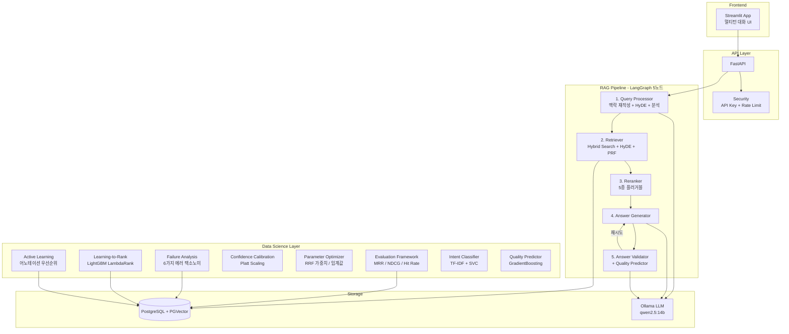
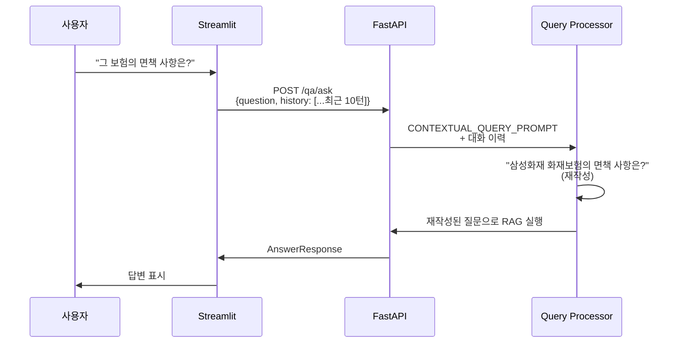
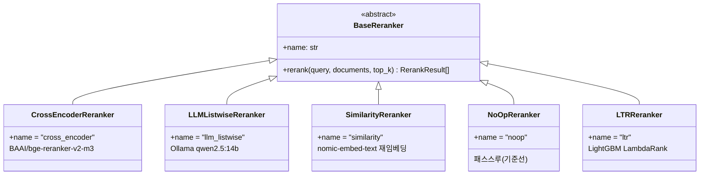
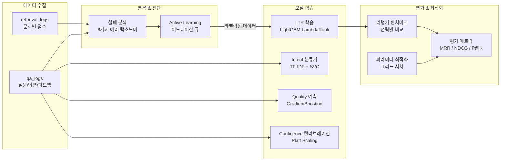
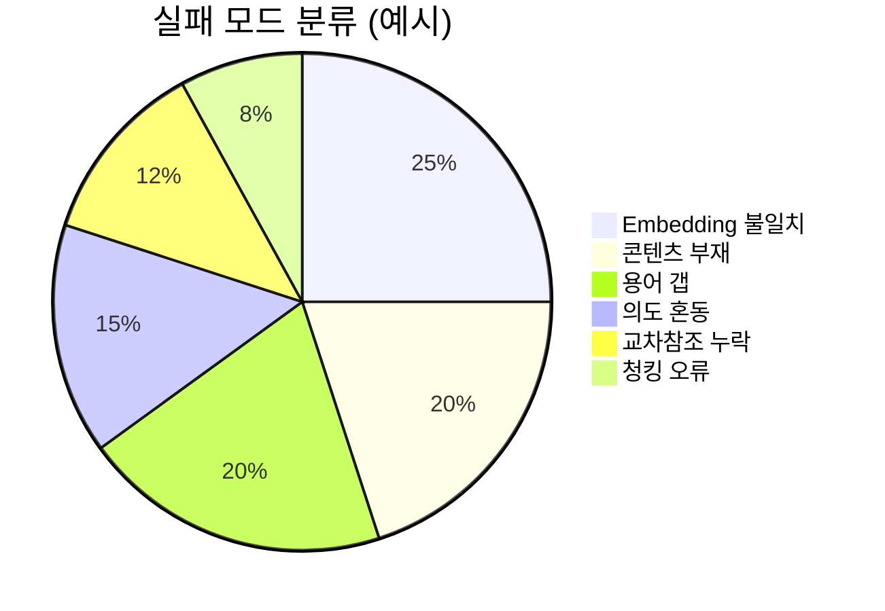

# Insurance QA Agent 고도화 작업 보고서

**작성일**: 2026-03-25
**프로젝트**: Insurance QA Agent — RAG 기반 보험약관 질의응답 시스템
**브랜치**: develop

---

## 1. 작업 개요

보험약관 RAG Q&A 시스템의 전면적 고도화를 수행. 기존 70% 완성도의 시스템에 14개 과제를 구현하여 RAG 파이프라인 품질, 데이터사이언스 인프라, 보안, UX를 대폭 향상.

### 작업 범위

| 구분 | 과제 수 | 핵심 영역 |
|------|---------|-----------|
| RAG 파이프라인 고도화 | 5개 | 멀티턴, 리랭킹, HyDE, 스트리밍, PRF |
| 데이터사이언스 인프라 | 6개 | 평가 프레임워크, LTR, 실패 분석, Active Learning |
| 보안 / 인프라 | 2개 | API 인증, Rate Limiting |
| 테스트 | 1개 | 커버리지 확장 (95개 테스트) |

---

## 2. 시스템 아키텍처 (고도화 후)



---

## 3. 구현 상세

### 3.1 RAG 파이프라인 고도화 (과제 1~6)

#### 과제 1: 멀티턴 대화 지원

이전 대화 맥락을 반영하여 대명사/맥락 참조를 해소.



**변경 파일**: `qa_schema.py`, `state.py`, `prompts.py`, `graph.py`, `qa_service.py`, `qa.py`, `01_qa.py`

#### 과제 2: 플러거블 리랭커 시스템

Strategy Pattern + Registry로 5종 리랭커를 환경변수 하나로 전환.



**전환 방법**: `RERANK_STRATEGY=cross_encoder` 환경변수 또는 `/admin/rerank/compare` 엔드포인트로 비교.

#### 과제 5: HyDE (Hypothetical Document Embeddings)

사용자 질문과 약관 문서의 임베딩 공간 차이를 해소. LLM으로 가상 약관 조항을 생성한 뒤 임베딩하여 dual embedding 검색.

#### 과제 6: 실시간 SSE 스트리밍

LangGraph `astream`을 활용하여 노드별 진행 상태를 실시간 전달.

```
event: status  → "질문 분석 중..."
event: status  → "약관 검색 중..."
event: status  → "검색 결과 재순위화..."
event: status  → "답변 생성 중..."
event: status  → "답변 검증 중..."
event: answer  → {answer, confidence, sources, log_id}
event: done
```

#### 과제 F: Pseudo-Relevance Feedback (PRF)

검색된 상위 3개 문서에서 핵심 한국어 용어를 추출하여 키워드를 확장. 학습 데이터 없이 즉시 적용 가능.

---

### 3.2 데이터사이언스 인프라 (과제 3, 4, A~E)

#### 전체 DS 파이프라인 아키텍처



#### 과제 3: Retrieval 로깅 + 평가 프레임워크

| 메트릭 | 설명 | 용도 |
|--------|------|------|
| MRR | 첫 번째 관련 문서의 역순위 평균 | 전체 검색 품질 |
| NDCG@K | 위치 가중 관련성 | 순위 품질 |
| Precision@K | 상위 K개 중 관련 문서 비율 | 정밀도 |
| Hit Rate@K | 관련 문서 포함 쿼리 비율 | 리콜 |

**RetrievalLog 테이블** — 문서별 `semantic_score`, `keyword_score`, `rrf_score`, `rerank_score`, `rank_before/after_rerank`, `rerank_strategy` 기록.

#### 과제 4: 신뢰도 캘리브레이션 + 파라미터 최적화

- **Platt Scaling**: `P(satisfied) = sigmoid(w * confidence + b)` — 피드백 데이터로 학습
- **RRF 가중치 최적화**: NDCG@5 최대화하는 (semantic_weight, keyword_weight) 그리드 서치
- **유사도 임계값 최적화**: 0.3~0.9 범위에서 최적 `SIMILARITY_THRESHOLD` 탐색

#### 과제 A: Retrieval 실패 분석



6가지 실패 모드를 자동 분류하고 모드별 개선 권고 생성:
- Embedding 불일치 → 도메인 임베딩 파인튜닝 권장
- 콘텐츠 부재 → 크롤러로 추가 약관 수집 필요
- 용어 갭 → 용어사전 기반 쿼리 확장 권장

#### 과제 B: Learning-to-Rank (LTR)

10개 피처를 LightGBM LambdaRank로 비선형 결합:

| 피처 | 설명 |
|------|------|
| semantic_score | PGVector 코사인 유사도 |
| keyword_score | ILIKE 키워드 매칭 비율 |
| rrf_score | RRF 융합 점수 |
| rerank_score | Cross-encoder 점수 |
| doc_length | 문서 길이 |
| article_level | 조항 계층 (관/조/항/호) |
| title_match | 쿼리 키워드-제목 매칭 |
| query_length | 질문 길이 |
| num_keywords | 키워드 수 |
| score_gap | top-1 대비 점수 차이 |

#### 과제 C: Active Learning

3가지 샘플링 전략으로 라벨링 효율 극대화:
1. **Uncertainty** — confidence 임계값 근처 쿼리
2. **Diversity** — 질문 길이/유형 분포 균등 샘플링
3. **Low confidence** — 모델이 가장 어려워하는 케이스

#### 과제 D: Intent 분류기

TF-IDF(char n-gram 3-5) + LinearSVC — CPU <50ms 추론. LLM 호출 1회(2-4초) 제거.

#### 과제 E: Quality 예측 모델

GradientBoosting 회귀로 feedback_score 예측. 예측값 >= 4.0이면 LLM 검증 스킵하여 3-5초 레이턴시 절감.

---

### 3.3 보안 (과제 7)

| 기능 | 구현 | 설정 |
|------|------|------|
| API 키 인증 | `X-API-Key` 헤더 | `API_KEY` 환경변수 (빈값=비활성) |
| Rate Limiting | IP별 sliding window | `RATE_LIMIT_RPM` (0=비활성) |
| CORS 제한 | 설정 기반 오리진 | `CORS_ORIGINS` (쉼표 구분) |

---

## 4. 변경 파일 요약

### 신규 파일 (20개)

| 파일 | 설명 |
|------|------|
| `api/retrieval/reranker.py` | 플러거블 리랭커 (5종 + 레지스트리) |
| `api/retrieval/query_expansion.py` | PRF 쿼리 확장 |
| `api/security.py` | API 키 인증 + Rate Limiting |
| `api/evaluation/__init__.py` | 평가 패키지 |
| `api/evaluation/metrics.py` | MRR, NDCG, Precision, Hit Rate |
| `api/evaluation/dataset.py` | Golden test set 관리 |
| `api/evaluation/runner.py` | 평가 실행기 + 리랭커 벤치마크 |
| `api/evaluation/calibration.py` | 신뢰도 캘리브레이션 |
| `api/evaluation/optimizer.py` | RRF 가중치/임계값 최적화 |
| `api/evaluation/failure_analysis.py` | 실패 분석 (6가지 에러 택소노미) |
| `api/evaluation/active_learning.py` | Active Learning 어노테이션 큐 |
| `api/evaluation/ltr.py` | Learning-to-Rank (LightGBM) |
| `api/evaluation/intent_classifier.py` | Intent 분류기 (TF-IDF + SVC) |
| `api/evaluation/quality_predictor.py` | Quality 예측 (GradientBoosting) |
| `alembic/versions/002_add_retrieval_log.py` | RetrievalLog 마이그레이션 |
| `tests/test_api/test_cache.py` | 캐시 테스트 (9개) |
| `tests/test_api/test_retrieval/test_reranker.py` | 리랭커 테스트 (11개) |
| `tests/test_api/test_evaluation/__init__.py` | 평가 테스트 패키지 |
| `tests/test_api/test_evaluation/test_metrics.py` | 메트릭 테스트 (14개) |
| `tests/test_api/test_evaluation/test_calibration.py` | 캘리브레이션 테스트 (10개) |

### 수정 파일 (16개)

| 파일 | 변경 내용 |
|------|-----------|
| `api/agents/graph.py` | 멀티턴, HyDE, reranker 노드, PRF 통합 |
| `api/agents/state.py` | conversation_history, hyde_embedding 필드 |
| `api/config.py` | rerank_strategy, api_key, rate_limit, cors 설정 |
| `api/db/models.py` | RetrievalLog 테이블 추가 |
| `api/llm/prompts.py` | CONTEXTUAL_QUERY, HYDE, RERANKING 프롬프트 |
| `api/main.py` | CORS 설정 기반, Rate Limiting 미들웨어 |
| `api/retrieval/hybrid_search.py` | RETRIEVER_OVER_FETCH_K 적용 |
| `api/routers/admin.py` | 평가/비교/실패분석/어노테이션 엔드포인트 |
| `api/routers/qa.py` | 멀티턴 history, SSE 스트리밍, API 키 인증 |
| `api/schemas/qa_schema.py` | ConversationMessage, history 필드 |
| `api/services/qa_service.py` | history 전달, ask_question_streaming |
| `app/pages/01_qa.py` | 대화 이력 API 전달 |
| `core/constants.py` | RERANK_TOP_K, RETRIEVER_OVER_FETCH_K, RERANK_MODEL |
| `pyproject.toml` | sentence-transformers, lightgbm, scikit-learn |
| `tests/conftest.py` | mock_ollama, mock_embedding, mock_db 픽스처 |

---

## 5. 테스트 결과

```
95 passed in 1.25s
ruff check: All checks passed
```

| 테스트 그룹 | 테스트 수 | 상태 |
|-------------|-----------|------|
| 기존 테스트 (agents, prompts, schemas, pdf_parser, hybrid_search) | 51 | PASS |
| 캐시 테스트 | 9 | PASS |
| 리랭커 테스트 | 11 | PASS |
| 평가 메트릭 테스트 | 14 | PASS |
| 캘리브레이션 테스트 | 10 | PASS |
| **합계** | **95** | **ALL PASS** |

---

## 6. 신규 API 엔드포인트

| Method | Path | 설명 |
|--------|------|------|
| POST | `/admin/rerank/compare` | 리랭커 전략별 결과 비교 |
| POST | `/admin/eval/reranker-benchmark` | Golden set 기반 리랭커 벤치마크 |
| POST | `/admin/eval/failure-analysis` | 실패 분석 (6가지 에러 택소노미) |
| GET | `/admin/eval/annotation-queue` | Active Learning 어노테이션 큐 |

---

## 7. 설정 변수 (신규)

| 변수 | 기본값 | 설명 |
|------|--------|------|
| `RERANK_STRATEGY` | `cross_encoder` | 리랭커 전략 (cross_encoder/llm_listwise/similarity/ltr/noop) |
| `API_KEY` | (빈값) | API 인증 키 (빈값=비활성) |
| `RATE_LIMIT_RPM` | `0` | 분당 요청 제한 (0=비활성) |
| `CORS_ORIGINS` | `*` | 허용 오리진 (쉼표 구분) |

---

## 8. 향후 계획

1. **데이터 축적 후**: LTR 모델 학습, Intent 분류기 부트스트래핑, Quality 예측기 학습
2. **실패 분석 기반 투자**: 에러 택소노미 비율에 따라 임베딩 파인튜닝 vs 크롤링 확대 결정
3. **A/B 테스트**: 리랭커 전략별 실서비스 비교 (noop vs cross_encoder vs ltr)
